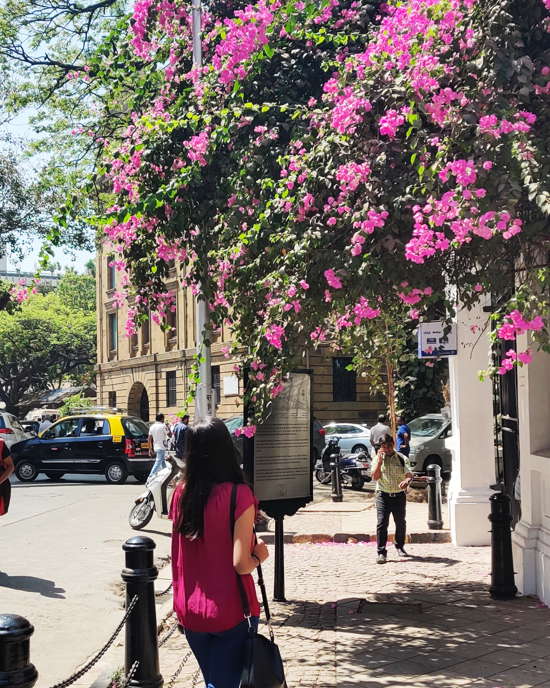

<!DOCTYPE html>
<html lang="en">
<head>
	<meta charset="UTF-8">
	<meta name="viewport" content="width=device-width, initial-scale=1" />
	<title>Introduction</title>
	<link rel="stylesheet" href="fintro.css">
	<link rel="stylesheet" href="https://cdnjs.cloudflare.com/ajax/libs/font-awesome/4.7.0/css/font-awesome.min.css">
	<link href="https://fonts.googleapis.com/css2?family=Amatic+SC:wght@700&display=swap" rel="stylesheet">
	
</head>
<body>
	

  		

				<a href="intro.html" class="active">Home</a>
				<a href="certi.html">Certificates</a>
				<a href="edu.html">Education</a>
				<a href="art.html">Arts</a>  

			
	
		

			<main>
    			<section class="left">
      				
    			</section>

        		<section >
		  			<h1 class="responsive">Hi! I am Sejal.</h1>
		  			
Currently I'm first year student pursuing  bachelor's degree in Computer Science B.sc.I dont have any such unique talents to show in this website but sometimes I doodle mandala designs. Just learning and trying to make websites and be productive during this lockdown. 
		  			This one is my first ever try to make a website from scratch so it may not be that perfect. I was a bit confused about on what topic I should make this website. Here it is, let me know what you think about it.

	    		</section>

			</main>

			<aside class="resp" >
				<h2>Get In Touch</h2>

				<form class="form">
					  <section class="form-text">
					    
					      <i class="fa fa-circle fa-stack-2x"></i>
					      <i class="fa fa-handshake-o fa-stack-1x"></i>
					    
					  </section>
					  <input type="text" class="form-name" placeholder="Name" required/>
					  <input type="text" class="form-email" placeholder="Email" required />
					  <input type="text" class="form-message" placeholder="Message" required />
					  <input type="submit" name="Submit" value="Submit" class="submit" />
					  
Say hello at 
					  "sejal_kaushilya@rediffmail.com"

				</form>
				

				

 
		     </aside>

		     

		     	

		     		<iframe  id="gmap_canvas" src="https://maps.google.com/maps?q=mumbai&t=&z=7&ie=UTF8&iwloc=&output=embed" > </iframe>
		     		
		     	

		     

	<footer>
		  
          
          

	</footer>	
	
</body>
</html>

